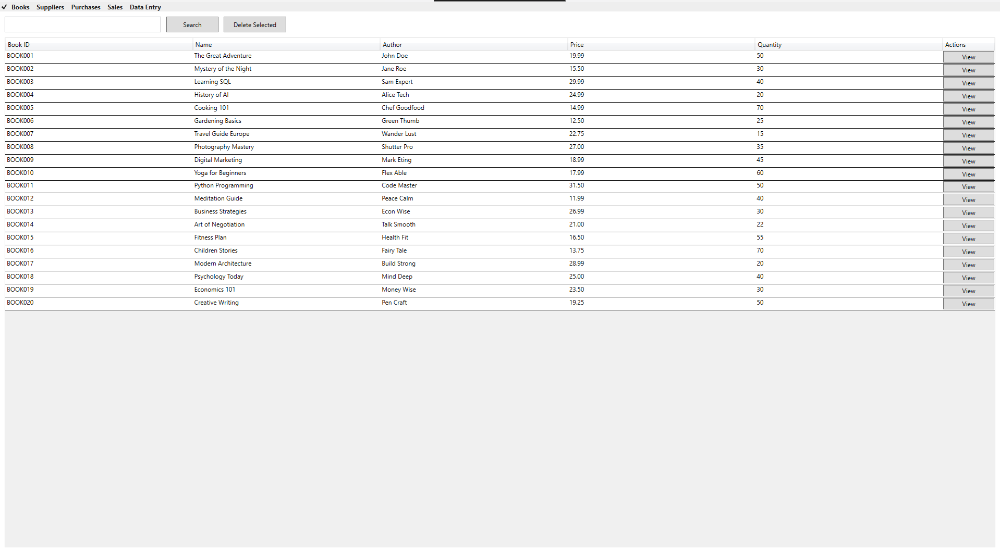
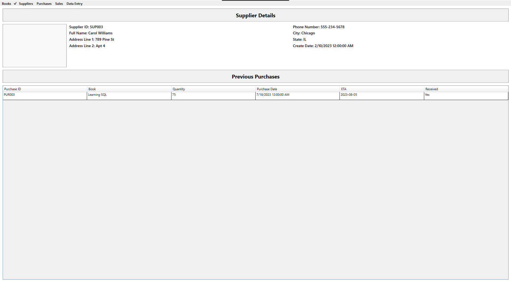
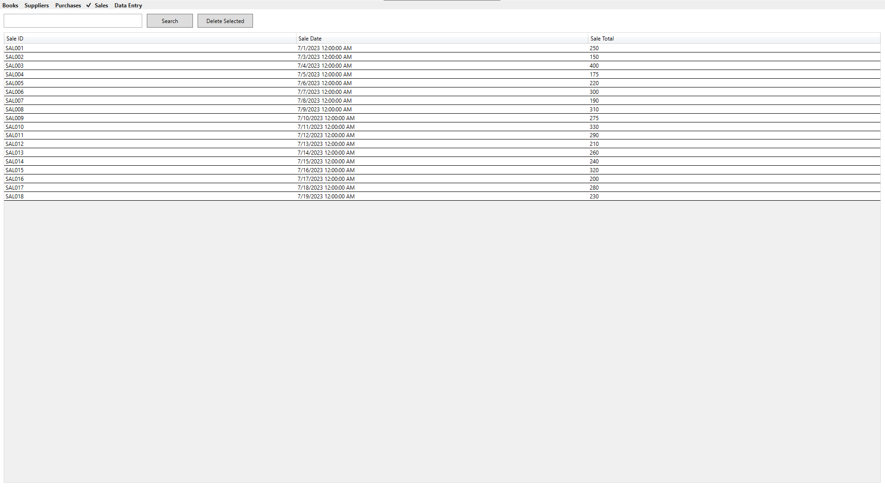

# Book Heaven – Complete Bookstore Management System

## Description
**Book Heaven** is a desktop-based bookstore management system I developed during my early years as a junior developer. Built using WPF (Windows Presentation Foundation) for the user interface and MySQL for backend data storage, the system was designed to simplify and digitize core bookstore operations.

The application allows for managing books, suppliers, purchases, and sales, with a focus on usability and data consistency. The backend features a normalized database schema with well-defined relationships and foreign key constraints, ensuring reliable data handling and integration with the WPF frontend. Book Heaven served as a foundational project that helped me gain hands-on experience with desktop application development, relational databases, and CRUD operations.

---

## Key Features
- **Books Management**  
  Add, edit, and view books with price, author, quantity, and cover image support.
- **Supplier Tracking**  
  Full profile management of book suppliers, including contact and location data.
- **Purchasing System**  
  Track book purchases from suppliers with quantity, ETA, and receive status.
- **Sales Records**  
  Log and analyze book sales linked to employees and members.
---

## Visuals

### Database Schema Diagram

> This diagram illustrates the entity relationships between tables.

---

### WPF Application Screenshots

### Books Table

### Supplier Profile

### Sales Table

> These visuals highlight the smooth WPF user interface and how Book Heaven simplifies bookstore management.